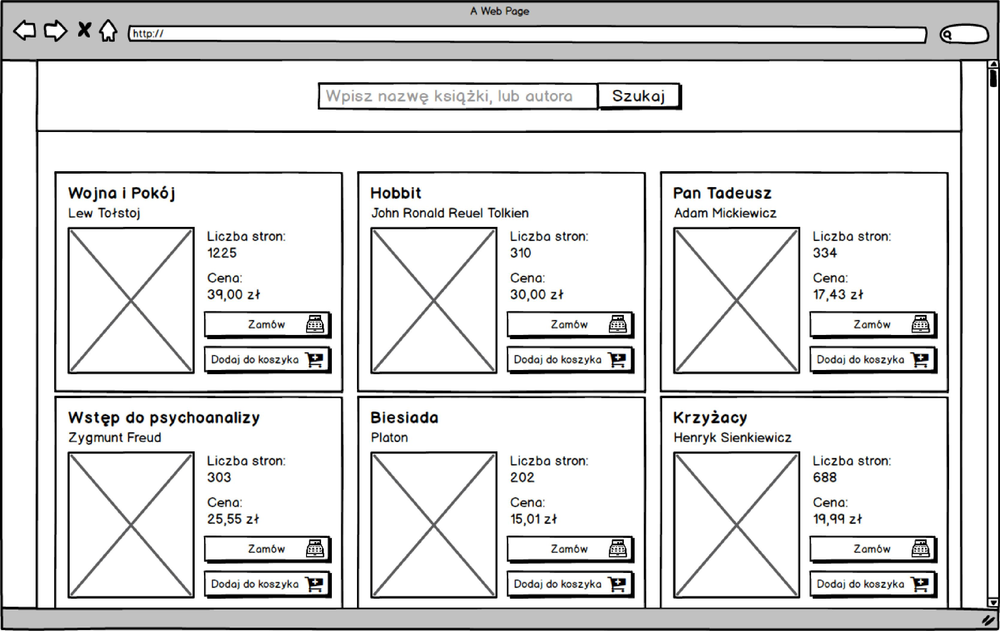
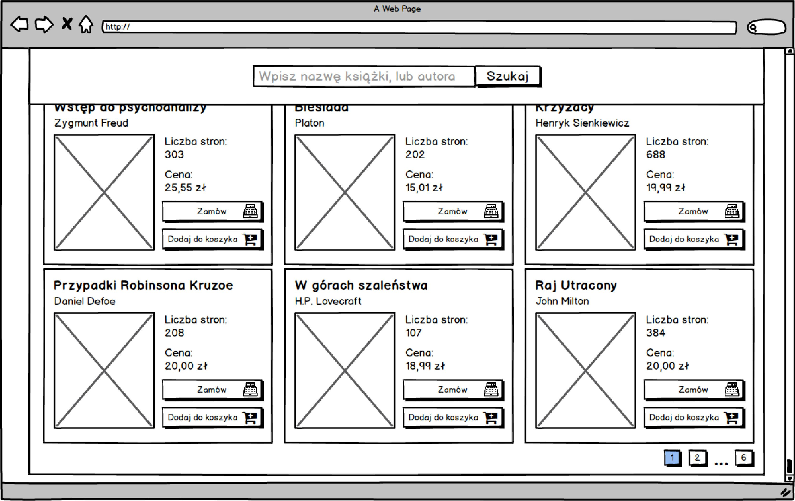
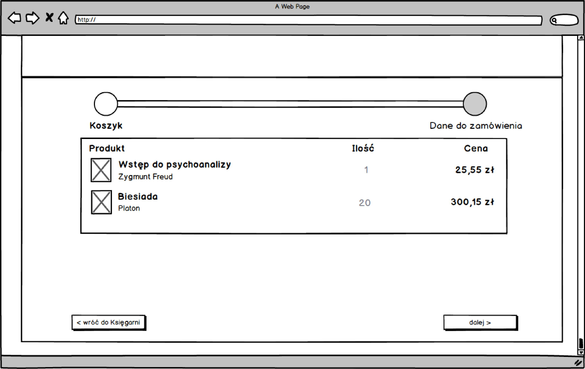
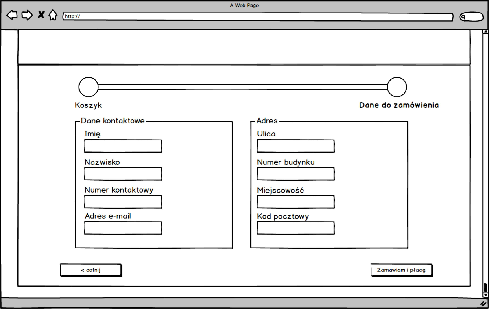

# Zadanie rekrutacyjne
Zadanie rekrutacyjne polega na napisaniu programu, który ma przedstawiać proces
 zakupowy książek (pobieranie danych o książkach z API, dodawanie i usuwanie
 produktów z koszyka, wypełnienie formularza danymi osobowymi potrzebnymi do
 realizacji zamówienia).

### Aplikacja powinna składać się z 3 podstron:
#### 1. Strona główna
###### Lista funkcjonalności składająca się na minimum dla ww. strony:
* pobieranie danych z API po wejściu na stronę aplikacji (**GET** _/book_),
* wyświetlenie wcześniej pobranych danych w konkretnym formacie, tj. każdą
 książkę powinien przedstawiać jeden blok, który ma w sobie zawierać okładkę
 książki, jej tytuł, autora, liczbę stron oraz dwa przyciski:
    * `DODAJ DO KOSZYKA`, który będzie dodawał konkretną pozycję do koszyka,
    * `ZAMÓW`, który będzie kierował do etapu podsumowania zamówienia.
###### Funkcjonalności dodatkowo punktowane:
- wyszukiwarka (po tytule lub autorze książki),
- paginacja (potrzebne dane będą zwracane z API, sposób realizacji dowolny).
#### 2. Strona prezentująca koszyk
###### Lista funkcjonalności składająca się na minimum dla ww. strony:
* wyświetlanie listy wybranych przez użytkownika książek,
* przycisk `DALEJ`, który będzie kierował do etapu podsumowania zamówienia.
##### 3. Strona zawierająca formularz potrzebny do złożenia zamówienia
###### Lista funkcjonalności składająca się na minimum dla ww. strony:
* przygotowanie formularza z polami:
    * imię,
    * nazwisko,
    * numer kontaktowy,
    * email,
    * ulica i numer budynku,
    * miejscowość,
    * kod pocztowy,
* wykorzystanie redux-form przy pracy z formularzem,
* przycisk `ZAMAWIAM I PŁACĘ` po naciśnięciu którego zostaną wysłane dane pod
 endpoint **POST** _/order_.
###### Funkcjonalności dodatkowo punktowane:
* walidacja formularza.

### Spis **wymaganych** technologii przy pracy z zadaniem
* react,
* redux,
* react-router,
* redux-form.

Middleware do wyboru: redux-thunk lub redux-saga.

### Za co przyznamy **dodatkowe punkty**
* testy,
* CSS-in-JS.

### Wireframe podpowiadające jak projekt może zostać zrealizowany





## Dokumentacja API
Dokumentacja w formacie OpenAPI 3 dostępna jest po uruchomieniu mock serwera
 i przejściu na adres: [localhost:3001/docs](http://localhost:3001/docs).

## Uruchamianie środowiska deweloperskiego
### Docker
Do repozytorium dołączona jest konfiguracja Node.js w kontenerach Dockerowych.
 Do uruchomienia przyda się komenda:
```bash
docker-compose up -d
```
Kilka porad Dockerowych znajdziesz [tutaj](./.docker/README.md).
## Manualne
Wymagane jest posiadanie Node.js wraz z Yarn. Projekt wymaga instalacji i
 uruchomienia API mock serwera:
```bash
cd api
cp .env.dist .env # Plik może wymagać modyfikacji
yarn install
yarn start
```
oraz uruchomienia właściwego projektu - frontend:
```bash
cd front
cp .env.dist .env # Plik może wymagać modyfikacji
yarn install
yarn start
```
